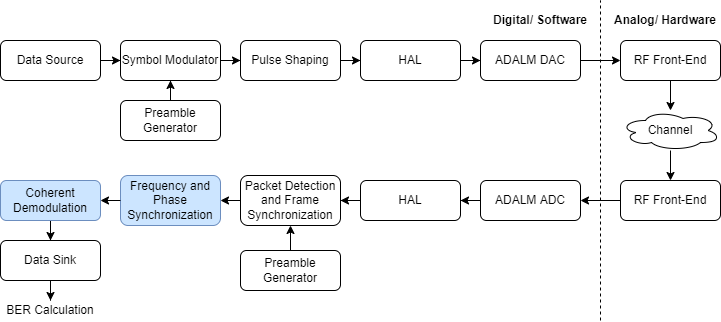
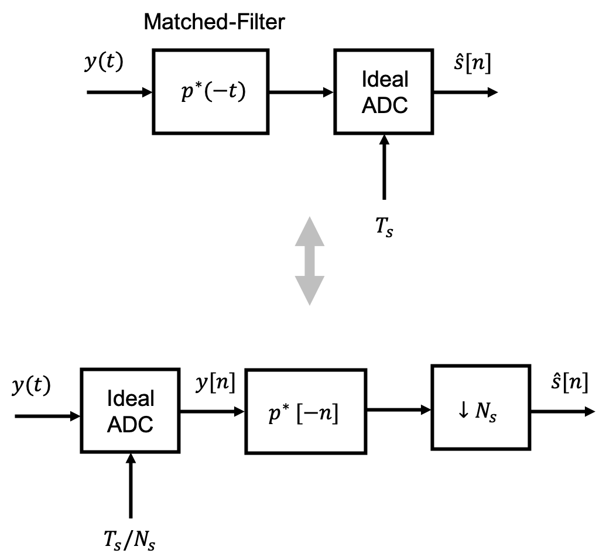
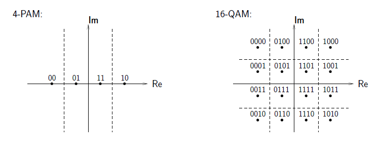
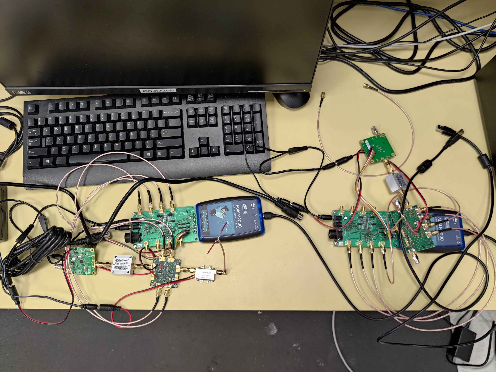

---
jupytext:
  formats: ipynb,md:myst
  text_representation:
    extension: .md
    format_name: myst
    format_version: 0.13
    jupytext_version: 1.13.5
kernelspec:
  display_name: Python 3 (ipykernel)
  language: python
  name: python3
---

# Lab 08 - Coherent Demodulation and QPSK

+++

## Purpose

In this lab, our goal is to realize the coherent communication between our Tx & Rx stations by building upon the previous lab and implementing two more functional modules: the frequency & phase synchronization module and the coherent demodulation module combing the matched filter. In the end, we will introduce the Quadrature Phase-Shift Keying (QPSK).

+++

## Outline

- Develop an algorithm for frequency offset estimation using FFT.
- Develop an algorithm for phase offset estimation by calculating the average of phase angles of received preamble samples. 
- Integrate and unit test the Frequency offset estimation block.
- Integrate and unit test the Phase offset estimation block.
- Develop and Implement the QPSK Symbol Demodulation algorithm.
- Test and optimize the system.

+++

## Block Diagram for Baseband Signal Processing



The block diagram above shows the basic software modules that are used to achieve coherent wireless communications, in which carrier phase information and frequency information are used for data demodulation on the receiver end. Most of the modules have been shown and discussed in previous labs and have the same functionality as before, so we only highlight the functionality of the two new modules here.

#### Frequency & Phase Sync

The frequency and phase sync modules compute estimates of the frequency and phase offsets of the received baseband signal so that they could be corrected before coherent demodulation & symbol demodulation. The estimation of the carrier frequency offset is obtained via the Fourier transform whereas the carrier phase offset is estimated by extracting the angle/phase from the complex exponential formed by the I and Q channel signals.

#### Demodulator (Coherent) 

Using the samples with timing, frequency and phase correction applied, the coherent demodulator performs coherent demodulation of the received signal based on the minimum distance / maximum likelihood detection. All bits of the demodulated packets are packed in an array and sent to the Data Sink.

+++

##  Frequency and Phase Synchronization

The complex BB signals received by ADALM can be characterized by the following equation:

$$ \hat{x}[n]=\hat{x}(nT)=A e^{j(2\pi \Delta f n T + \Delta \varphi)} \hat{s}[nT]$$

where: $A$ is some scaling factor of the received complex BB signal, $T$ is the sampling period of the ADC, $\hat{s}[nT]$ represents the complex baseband signal that was originally transmitted, and the variables $\Delta f$ and $\Delta \varphi$ represent the unknown carrier frequency offset and carrier phase offset. These two offset values remain unknown and changing from packet to packet due to the random drift of two local oscillators. In order to peform coherent demodulation and correct the frequecny and phase offset of the BB signals, we need to know/estimate the carrier frequency offset $\Delta f$ and phase offset $\Delta \varphi$. In the following two sub-sections, we are going to demonstrate how the frequency and phase offsets could be estimated.

After expansion (note that $\hat{s}[nT] = s_I[nT] + j \cdot s_Q[nT]$), we have:

$$\hat{x}[n] = x_I[n] + j \cdot x_Q[n] $$

where

$$ x_I[n]=A \Big[ cos(2\pi \Delta f n T + \Delta \varphi) s_I[nT] - sin(2\pi \Delta f n T + \Delta \varphi) s_Q[nT] \Big]$$

and

$$ x_Q[n]=A \Big[ cos(2\pi \Delta f n T + \Delta \varphi) s_Q[nT] + sin(2\pi \Delta f n T + \Delta \varphi) s_I[nT] \Big]$$

### Carrier Frequency Offset (CFO) Estimation

One common approach to obtaining an estimate of the carrier frequency offset is to compute the fast Fourier transform (FFT) magnitude response of the preamble samples and look for the frequency $\hat{\Delta f}$ corresponding to the peak of the FFT magnitude.

If this method is adopted, it is important to note that an appropriate FFT size or amount of zero-padding may be needed in order to achieve the desired frequency resolution, i.e., size of each frequency bin. For example, if in our communication system the ADC sampling rate is $f_{in} = 1 MHz$ and the preamble samples are zero-padded to $N=100,000$ points. Then the frequency resolution of the FFT output will be given by the following:

$$\mathrm{FFT\ Frequency\ Resolution} = \frac{f_{in}}{N} = 10\ \mathrm{Hz}$$

If we would like to estimate the carrier frequency offset more accurately, e.g., in the order of 10 Hz, we need more data points in the FFT.

### Carrier Phase Offset (CPO) Estimation

To see how the carrier phase offset can be estimated, let us first assume that by performing FFT on the preamble samples we are able to obtain an estimate of the carrier frequency offset, $\hat{\Delta f}$.

We can then generate a complex LO for demodulation purpose:

$$ \hat{LO}[n] = e^{- j2\pi \hat{\Delta f} nT} $$

Now, if we multiply the received complex signal with the LO and note that our preamble is OOK modulated (original signal only has I component), we will obtain the following:

$$\hat{x}[n] \cdot \hat{LO}[n]  = r_I[n] + j \cdot r_Q[n]$$

where 

$$r_I[n] =    A \Big[ cos(2\pi \Delta f n T + \Delta \varphi) s_I[nT] \Big]  \cos(2\pi \hat{\Delta f} nT) +  A \Big[ sin(2\pi \Delta f n T + \Delta \varphi) s_I[nT] \Big]  \sin(2\pi \hat{\Delta f} nT)$$

and

$$r_Q[n] =     - A \Big[ cos(2\pi \Delta f n T + \Delta \varphi) s_I[nT] \Big]  \sin(2\pi \hat{\Delta f} nT) + A \Big[ sin(2\pi \Delta f n T + \Delta \varphi) s_I[nT] \Big]  \cos(2\pi \hat{\Delta f} nT) $$

By applying  trigonometric identities, we further have:

$$r_I[n] = A cos(2\pi \Delta f n T - 2\pi \hat{\Delta f} n T + \Delta \varphi) s_I[nT] $$

and

$$r_Q[n] = A sin(2\pi \Delta f n T - 2\pi \hat{\Delta f} n T  + \Delta \varphi) s_I[nT] $$

Now, if the estimate of carrier frequency offset is close enough such that $\Delta f - \hat{\Delta f} $ is small, we approximately have:

$$r_I[n] = A cos(\Delta \varphi) s_I[nT] $$

and

$$r_Q[n] = A sin(\Delta \varphi) s_I[nT]  $$

The carrier phase can then be estimated through the following equation:

$$\hat{\Delta \varphi} \approx angle(r_I[n] + j \cdot r_Q[n])$$

Since there are multiple, noisy samples of $r_I[n]$ and $r_Q[n]$, we can average the estimated $\hat{\varphi}$ for all $n$ in the preamble.

+++

## Exercise 8.1: Developing an algorithm for Frequency Synchronization

**Note:** Find the line that you need to edit by look for red colored text. After you edit a particular line remove out the comment sign. Try to stick to the variable names, this helps the TAs to debug.

**Note:** Run 'pip install pyfftw' in a command window to install pyfftw package, if you notice an error.

```{code-cell} ipython3
import numpy as np
from scipy import signal
import pyfftw
import scipy.fftpack
import matplotlib.pyplot as plt

# --- import functions for generating the baseband signal ---

import pulse_shaping
import preamble_generator
import symbol_mod

# --- Preparing the inputs for the function ---

# Generate ideal baseband signal
np.random.seed(2021) # seed to save the exact random numbers
N = 1000 # number of data bits
Bits = np.random.randint(0,2,N)  #random data
preamble = preamble_generator.preamble_generator()  
packet_bits = np.append(preamble, Bits)
preamble_length = len(preamble)
baseband_symbols = symbol_mod.symbol_mod(packet_bits, 'QPSK', preamble_length)
pulse_shape = 'rrc'
M = 8 #samples per symbol
fs = 1000000 #sampling rate in Hz
Ts = 1/fs
baseband = pulse_shaping.pulse_shaping(baseband_symbols, M, fs, pulse_shape, 0.9, 8)
# plt.plot(baseband)

# --- emulating a uniform frequency offset (for input to the function) ---

frequency_offset = np.random.uniform(-0.01*fs,0.01*fs)
t =  np.arange(0,len(baseband)*Ts,Ts)
nonideal_term = np.exp(1j*2*np.pi*frequency_offset*t)
baseband_with_frequency_offset = np.multiply(baseband,nonideal_term)

# plt.plot(baseband_with_frequency_offset)


# ------ Algorithm for Frequency offset estimation ------

# This algorithm mimics a function that estimates carrier frequency offset using the FFT

# Inputs:

segments_of_data_for_fft = baseband_with_frequency_offset # input data with frequency offset
num_fft_point = 800 # FFT length (increase till desired freq offset resolution obtained)
fs_in = fs*1.0 # ADC input sampling rate

# --- Copy from here ---
# Perform FFT on a segment of samples recevied

# Hint 1: Please use library functions including: abs() and pyfftw.interfaces.scipy_fftpack.fft()
# (which is a faster version of FFT function compared with SciPy/NumPy implementation)
# Hint 2: Our goal is to peform FFT on array of samples named "segments_of_data_for_fft" with 
# "num_fft_point" number of points
        
spectrum = abs(pyfftw.interfaces.scipy_fftpack.fft(segments_of_data_for_fft, num_fft_point))

# FFT shift so that DC component (zero freq) is in the middle of the array of FFT result                
spectrum = np.fft.fftshift(spectrum)

# Hint: You may find np.argmax() useful
peak_position = np.argmax(spectrum)

# Output: 

#Obtain the estimated carrier frequency offset
coarse_frequency = (peak_position-len(spectrum)/2) / len(spectrum) * fs_in

# --- Copy till here ---

# -----End-----


#compare the estimated frequency offset with the actual frequency offset
print("estimated frequency offset:", coarse_frequency)
print("actual frequency offset:", frequency_offset)
```

### Requirements for report
<font color='red'>
    
- Final edited code block (including the function).
    
- Screenshot showing that estimated offser and actual random offset is close to each other.
    
- Change the FFT length and repeat the experiment. Through screenshots, report the accuracy of offset for various FFT lengths.

+++

## Exercise 8.2: Developing an algorithm for Phase Synchronization

**Note:** Find the line that you need to edit by look for red colored text. After you edit a particular line remove out the comment sign. Try to stick to the variable names, this helps the TAs to debug.

```{code-cell} ipython3
import numpy as np
from scipy import signal
import matplotlib.pyplot as plt

import pulse_shaping
import preamble_generator
import symbol_mod

np.random.seed(2021)
N = 1000 # number of data bits
Bits = np.random.randint(0,2,N)
preamble = preamble_generator.preamble_generator()  
packet_bits = np.append(preamble, Bits)
preamble_length = len(preamble)
baseband_symbols = symbol_mod.symbol_mod(packet_bits, 'QPSK', preamble_length)
pulse_shape = 'rrc'
samples_perbit = 8 #samples per symbol
fs = 1000000 #sampling rate in Hz
Ts = 1/fs
baseband = pulse_shaping.pulse_shaping(baseband_symbols, samples_perbit, fs, pulse_shape, 0.9, 8)

frequency_offset = np.random.uniform(-0.01*fs,0.01*fs)
phase_offset = np.random.uniform(-np.pi,np.pi)
t = np.arange(0,len(baseband)*Ts,Ts)

nonideal_term = np.exp(1j*(2*np.pi*frequency_offset*t + phase_offset))
packet_data = np.multiply(baseband,nonideal_term) #packet data samples with frequency and phase 
Digital_LO = np.exp(1j*(-2*np.pi*frequency_offset*t)) # locally generated complex LO for frequency 
preamble_length = 180
payload_start = int(preamble_length*samples_perbit)

packet_data_freq_corrected = np.multiply(packet_data, Digital_LO)

packet_data_freq_corrected = packet_data_freq_corrected - np.mean(packet_data_freq_corrected\
                                                                  [payload_start:])
preamble = packet_data_freq_corrected[0:int(preamble_length*samples_perbit)]

angles = np.angle(preamble)

phase_estimated = np.mean(angles)

phase_corrected_packet = np.multiply(packet_data_freq_corrected, np.exp(-1j*phase_estimated))

plt.plot(np.real(packet_data[0:1700]))
plt.title('BB I channel before frequency and phase sync')
plt.show()

plt.plot(np.real(phase_corrected_packet[0:1700]))
plt.title('BB I channel after frequency and phase sync')
plt.show()
```

### Requirements for report
<font color='red'>
    
- Final edited code block (including the function).
    
- Screenshot of the plot before and after phase offset estimation. Why does the plot of I channel baseband symbols with phase and frequency offset have a region that looks like a sine wave? (Hint: Preamble is modulated OOK symbols + bunch of ones appended after.)

+++

## Exercise 8.3: Implementing the Carrier Frequency Offset Estimation

**Note:** Go to exercise 8.1 and copy the part of code that has been intended to copy. Now find the file named freq_sync.py in the lab folder and replace the relevant part of the code in the function definition, by the earlier copied code segment. Then run the below code snipped and verify whether your output matches with the desired one.

```{code-cell} ipython3
import numpy as np
from scipy import signal
import pyfftw
import scipy.fftpack

import freq_sync

freqsync_data = np.load('FreqSync_data.npz') #load

segments_of_data_for_fft = freqsync_data['segments_of_data_for_fft']
num_fft_point = freqsync_data['coarse_fft_point']
fs_in = freqsync_data['fs_in']
coarse_frequency_desired = freqsync_data['coarse_frequency']

coarse_frequency = freq_sync.freq_sync(segments_of_data_for_fft, num_fft_point, fs_in)

# compare the obtained frequency offset with the desired frequency offset
print(np.array_equal(coarse_frequency, coarse_frequency_desired, equal_nan=False))
```

## Exercise 8.4: Implementing the Carrier Phase Offset Estimation

**Note:** Steps have been commented (##) before the line you need to edit. After you edit a particular line remove out the comment sign. Try to stick to the variable names, this helps the TAs to debug.

**Note:** First complete the function in this exercise using the help provided in comments. After your comparison comes out to be a match (true), replace the part in phase_sync.py by copying just your working function (or the two lines of code).

```{code-cell} ipython3
import numpy as np
from scipy import signal

import phase_sync
    
phasesync_data = np.load('PhaseSync_data.npz') #load

packet_data = phasesync_data['payload_and_ones']
Digital_LO = phasesync_data['Digital_LO']
payload_start = phasesync_data['payload_start']
preamble_length = phasesync_data['ones_length']
samples_perbit = phasesync_data['samples_perbit']
phase_corrected_packet_desired = phasesync_data['payload_and_ones_corrected']

phase_corrected_packet = phase_sync.phase_sync(packet_data, Digital_LO, payload_start,preamble_length, samples_perbit)

# compare the obtained phase offset corrected packet with the desired packet
print(np.array_equal(phase_corrected_packet, phase_corrected_packet_desired, equal_nan=False))
```

##  Optimal Dection in AWGN Channel

### Maximum Likelihood Detection in an AWGN Channel

According to the book "Software-Defined Radio for Engineers", "in general, for a fixed set of data and underlying probability model, a maximum likelihood approach selects values of the model parameters that produce the distribution that are most likely to have resulted in the observed data (i.e., the parameters that maximize the likelihood function)." Mathematically, for data transmitted through an AWGN channel, we could model the received signal through the following equation:

$$\mathbf{r} = \mathbf{s}_i + \mathbf{n}$$

where $\mathbf{s}_i$ is a vector of the samples of the $i$th signal waveform possibly sent by the transmitter during the symbol period, $\mathbf{n}$ is the noise introduced
to the data transmission by the AWGN channel, and $\mathbf{r}$ is the received signal
samples at the receiver. 

Suppose we consider the conditional probability of a single element of the received vector $\mathbf{r}=\rho$, say the $k$th element, given that the signal waveform $\mathbf{s}_i$ was assumed to be transmitted, then we have:

$$f(\rho_k | s_{ik}) = \frac{1}{\sqrt{2\pi\sigma^2}} e^{-(\rho_k-s_{ik})^2/2\sigma^2}$$

where the $k$ the element of the noise vector is equal to $n_k = \rho_k - s_{ik}$. Now, if we assume the AWGN vector elements are uncorrelated (independent), the conditional probability of receiving the vector $\rho$ given that $\mathbf{s}_i$ is transmitted can be described by the following equations:

$$f(\rho | \mathbf{s}_i) = \prod_{k=1}^{N} f(\rho_k | s_{ik})$$ 

$$f(\rho | \mathbf{s}_i) = \frac{1}{(2\pi\sigma^2)^{N/2}} e^{-||\rho-\mathbf{s}_i||^2/2\sigma^2}$$

The maximum likelihood (ML) detection thus requires us to find the choice of $\mathbf{s}_i$ that maximizes the expression above, which is equivalent to the following minimum distance decision:

$$ \mathbf{s}_k = \underset{\mathbf{s}_i}{\arg\min}\ ||\rho -  \mathbf{s}_i ||$$

### Matched Filtering and Sampling for Demodulation

The transmit side pulse shaping is often combined with a receive side *matched filter* to maximize the SNR of the received signal, and to achieve the optimum tolerance for noise in the system. This is illustrated in the figure below in both CT and DT, again with symbol period $T_s$ seconds and oversampling factor $N_s$ samples per symbol.




To derive the matched filter, consider a transmit filter $p(t) \leftrightarrow P(f)$ and arbitrary receive filter $q(t) \leftrightarrow Q(f)$. It can be shown that the optimal choice of the transfer function of the receive filter is given by

$$q_{mf}(t) = A\ p^*(-t) \leftrightarrow Q_{mf}(f) = A\ P^*(f)$$

where $A$ is an arbitrary constant, but often chose to be $A=1$ for simplicity. Sampling the output of this matched filter at time $t=0$ implements the correlation

$$\int_{-\infty}^{\infty} p(t)p^*(t) dt = \int_{-\infty}^{\infty} P(f) P^*(f) df$$

which is the energy of the transmit pulse shape.

In the above discussion, the transmit and receive filters combine to create a zero-phase system, which will in general be non-causal. To make the system causal and therefore practically implementable, we can introduce a delay $\tau_1>0$ in the transmit pulse $p(t-\tau_1)$ and delay $\tau_2>0$ in the matched filter $q_{mf}(t-\tau_2)=p^*(\tau_2-t)$. In this case, the output of the matched filter will correspond to its maximum of the transmit pulse energy if we sample at time $t=\tau_1 + \tau_2$, i.e., the overall delay through the system is $\tau_1 + \tau_2$.
    
In our implementation the pulse shaping is equally distributed between the sender and receiver filters by utilizing two root raised-cosine filters which together gives an impulse response of a raised-cosine filter. Note that a root raised-raised cosine filter is a matched filter of itself. If we delay each filter by $LT$ seconds and truncate to make it causal as outlined above, the overall delay through the transmit and receive filters together will be $2LT$ seconds.

### Symbol Demodulation

Symbol demodulation, which is also referred to as symbol decoding or symbol-to-bit mapping, converts the downsampled matched filter outputs, which can be viewed as degraded constellation symbol sequences, back to bit sequences. Often symbol demodulation implements the maximum likelihood (ML) detector or a low-complexity approximation to it. Due to the presence of noise as well as other factors such as residual errors in carrier frequency and phase estimations, the downsampled matched filter outputs are distributed around the transmitted symbols in the constellation diagram.

For discrete-time equivalent channels modeled by AWGN, the ML decision rule is simply to choose the constellation symbol that is closest to the downsampled matched filter output, i.e., the minimum distance detector. Specifically, if we model the downsampled match-filter output sample

$$\mathbf{r} = \mathbf{s}_i + \mathbf{n}$$

where $\mathbf{s}_i$, $i=1,2,\ldots,N$, denotes the symbols in the constellation, $N$ is the total number of constellation points, $\mathbf{n}$ is the noise introduced to the data transmission by the AWGN channel, and $\mathbf{r}$ is the received symbol.

The probability of receiving the symbol $\mathbf{r}$ given that the symbol $\mathbf{s}_i$ is transmitted can be expressed as follows:

$$f(\mathbf{r} | \mathbf{s}_i) = \frac{1}{(2\pi\sigma^2)^{N/2}} e^{-||\mathbf{r}-\mathbf{s}_i||^2/2\sigma^2}$$

where $N$ here is the dimension of the signal space (or the number of bases for each symbol). For example, in the case of QPSK modulation scheme, the I and Q axes form two bases ($\sqrt{\frac{2}{T_s}}\cos(2\pi ft)$ and $\sqrt{\frac{2}{T_s}}\sin(2\pi ft)$ where $T_s$ is the symbol period).

The ML and minimum distance decision rule therefore decides on the transmitted symbol via

$$ \hat{ \mathbf{s} } = \underset{\mathbf{s}_i,i=1,2,\ldots,N}{\arg\min}\ ||\mathbf{r}  -  \mathbf{s}_i ||$$

Since the decision rule requires us to choose the symbols that are closest to the received symbols, we can draw what are known as the decision regions in the constellation diagram. For example, the figures below show the decision regions for 4-PAM and 16-QAM modulation schemes.




+++

## Exercise 8.5: Developing and Implementing the QPSK Symbol Demodulation

The following script implemented the minimum distance based symbol demodulation for the signals with OOK and BPSK mdoulation schemes. You task is to fill out the remaining portions of the QPSK symbol demodulation.

**Note:** First complete the function in this exercise using the help provided in comments. After your comparison comes out to be a match (true), replace the part in symbol_demod.py by copying just the part of the code that you have changed.

**Note:** Steps have been commented (##) before the line you need to edit. After you edit a particular line remove out the comment sign. Try to stick to the variable names, this helps the TAs to debug.

```{code-cell} ipython3
import numpy as np
import matplotlib.pyplot as plt
from scipy import signal
import time

#Define the symbol_mod module

#The symbol_demod module takes the following arguments as inputs:

# baseband symbols:            The symbols array to be mapped into bits

# scheme:                      A string indicating which scheme is adopted (e.g.: "OOK", "QPSK")

# channel_gain                 This is the gain of the channel, channel impulse response is simply modeled as g(t)= 
# channel_gain*delta(t)

#The symbol_demod module returns the following argument as output:

# a_demodulated:              An array containing the demodulated bits


def symbol_demod(baseband_symbols, scheme, channel_gain): #"a" is the bit array to be modulate

        a_demodulated = []
        
        if(scheme == 'OOK'):

                s_on = 1.0 * channel_gain

                s_off = 0* channel_gain

                baseband_symbols_I = baseband_symbols[0]

                baseband_symbols_Q = baseband_symbols[1]


                baseband_symbols_complex = baseband_symbols_I + 1j * baseband_symbols_Q


                for i in range( len(baseband_symbols_complex) ):

                        #Coherent: finding the minimum distance between the received symbol and all reference symbols 
                        # in the constellation plot.

                                if (np.abs(baseband_symbols_complex[i] - s_on) < np.abs(baseband_symbols_complex[i] - s_off)):
                                       a_demodulated.append(1)
                                else:
                                       a_demodulated.append(0)


        if(scheme == 'BPSK'):

                baseband_symbols_I = baseband_symbols[0]

                baseband_symbols_Q = baseband_symbols[1]

                reference_plus = 1.0*channel_gain

                reference_minus = -reference_plus

                baseband_symbols_complex = baseband_symbols_I + 1j * baseband_symbols_Q

                for i in range(len(baseband_symbols_complex)):

                    #Find the minimum distance between the received symbol and all reference symbols in the constellation plot.

                        if (np.abs(baseband_symbols_complex[i] - reference_plus) < np.abs(baseband_symbols_complex[i] - \
                                                                                          reference_minus)):
                               a_demodulated.append(0)
                        else:
                               a_demodulated.append(1)


        if(scheme == 'QPSK'):

                baseband_symbols_I = baseband_symbols[0]

                baseband_symbols_Q = baseband_symbols[1]


                I_demodulated = []
                Q_demodulated = []

                #Construct the received symbols on the complex plane (signal space constellation)
                baseband_symbols_complex = baseband_symbols_I + 1j * baseband_symbols_Q

                #Compute and define the reference signals in the signal space (4 constellation points)
                reference_00 = -1.0*channel_gain  -1j* channel_gain

                reference_11 = 1.0*channel_gain + 1j* channel_gain

                reference_01 = -1.0*channel_gain + 1j* channel_gain

                reference_10 = 1.0*channel_gain  -1j* channel_gain

                #Start a for-loop to iterate through all complex symbols and make a decision on 2-bits of data 

                for i in range(len(baseband_symbols_complex)):

                        symbol = baseband_symbols_complex[i]

                        #Find the minimum distance between the received symbol and all symbols in the constellation plot.

                        if (  np.abs(symbol - reference_11) == np.amin(  [np.abs(symbol - reference_11),  \
                                                                          np.abs(symbol - reference_10), \
                                                                          np.abs(symbol - reference_00), \
                                                                          np.abs(symbol - reference_01)]  )  ):
                               I_demodulated.append(1)
                               Q_demodulated.append(1)
                        elif(np.abs(symbol - reference_10) == np.amin(  [np.abs(symbol - reference_11),  \
                                                                          np.abs(symbol - reference_10), \
                                                                          np.abs(symbol - reference_00), \
                                                                          np.abs(symbol - reference_01)]  )  ):
                               I_demodulated.append(1)
                               Q_demodulated.append(0)
                        elif(np.abs(symbol - reference_01) == np.amin(  [np.abs(symbol - reference_11),  \
                                                                          np.abs(symbol - reference_10), \
                                                                          np.abs(symbol - reference_00), \
                                                                          np.abs(symbol - reference_01)]  )  ):
                               I_demodulated.append(0)
                               Q_demodulated.append(1)
                        elif(np.abs(symbol - reference_00) == np.amin(  [np.abs(symbol - reference_11),  \
                                                                          np.abs(symbol - reference_10), \
                                                                          np.abs(symbol - reference_00), \
                                                                          np.abs(symbol - reference_01)]  )  ):
                               I_demodulated.append(0)
                               Q_demodulated.append(0)

                a_demodulated = np.append(I_demodulated, Q_demodulated)


        return a_demodulated


#Helper function

#Rotating a vector in constellation diagram:

#Take a complex number (2-D vector) as input (referenced through x, y coordinate) and return the coordinate of the 
# rotated vector (by angle radians)

def rotate(vector, angle):

        x = np.real(vector)

        y = np.imag(vector)

        x_new = np.cos(angle)*x - np.sin(angle)*y

        y_new = np.sin(angle)*x + np.cos(angle)*y

        vector_new = x_new + 1j*y_new
        

        return vector_new

qpskdemod_data = np.load('SymbolDemodResult.npz') #load

baseband_symbols = qpskdemod_data['baseband_symbols']
scheme = qpskdemod_data['scheme']
channel_gain = qpskdemod_data['channel_gain']
demod_bits = qpskdemod_data['a_demodulated']

demodulated_bits = symbol_demod(baseband_symbols, scheme, channel_gain)

# compare the obtained demodulated bits with the desired demodulated bits
print(np.array_equal(demodulated_bits, demod_bits, equal_nan=False))
```

## Exercise 8.6: Testing and Verification of the system

**Note**: Connect according to the block diagram, first perform the exercise for wired communication using an SMA cable (an attenuator should be added after the modulator board). Now switch to wireless using two antennas, here make sure that you dont forget to connect the LNA after the receiver antenna. Also, it is important to connect the Tx ADALM to the PC first before connecting the Rx ADALM.

- **Step 1: Calibration** <br>
a) Open a command window in the source folder and run the python command 'python tx_main_calibrate.py -m 4 -s'. <br>
b) Open another command window and run 'python rx_main_calibrate.py -m 4 -s'. <br>
c) Make sure that the IQ gain ratio is around 1, otherwise reduce the distance between Tx and Rx antennas (only for wireless) and repeat the calibration. It is important to not disturb the setup (again only wireless) once the calibration is completed. <br>

- **Step 2: Checking BER** <br>
a) Open a command window in the source folder and run the python command 'python tx_main_rf.py -m 4 -s' and DO NOT press enter  to start the Txn. <br>
b) Open another command window and run 'python rx_main_rf.py -m 4 -s' and then go to the Tx command window and press enter to start the Txn. <br>
c) Observe whether the long term BER is zero or reduce the distance (only wireless) and repeat. Make sure you calibrate again before repeating. <br>

### Setup



### Requirement for Report
<font color='red'>
    
- Save a screenshot of command window showing the long term BER to be zero. Do this for both wired and wireless case.

```{code-cell} ipython3

```
